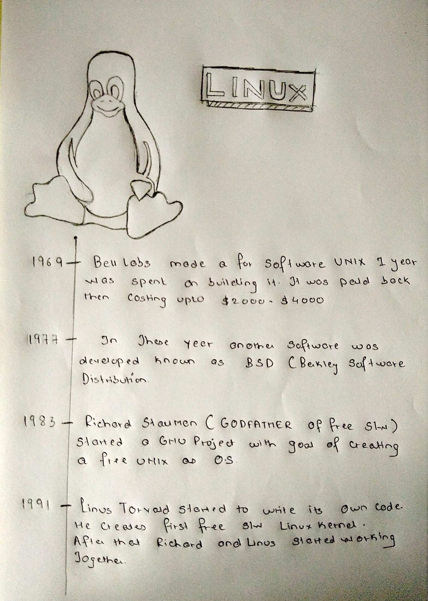

# LINUX

---

- Linux is not an operating system. But it is an Kernel.
- GNU/Linux is an operating system.

# History Of Linux

---

# Famous Linux Distro's

---

1. GNU Linux
2. Debian -> (Ubuntu)
3. RedHat -> (Centos , Mint)

# Basic Linux Commands

---

| Commands   | Description                                                            |
| ---------- | ---------------------------------------------------------------------- |
| ls         | Lists all the things present in the current directory                  |
| cd         | To change the directory                                                |
| cp         | To Copy one file to another location                                   |
| mv         | Moves one to another                                                   |
| rm         | Removes the file permanently                                           |
| pwd        | Shows the current working directory                                    |
| who        | How many users are connected to the system                             |
| whoami     | Shows current login users                                              |
| history    | Shows us how many commands have been runned                            |
| exit       | Closes the terminal                                                    |
| cat        | It is used to read from the file                                       |
| cat > file | It is used to write in the file & ">>" it is use for updating the file |
| less       | Shows us the more content                                              |
| more       | Shows us the less content                                              |
| echo       | It displays the text which is passes to the command                    |
| top        | Shows us the current load of the system                                |
| ps         | The application which is running is displayed                          |
| touch      | It is used to create a new file                                        |
| ping       | Shows us the connectivity to the outer world                           |
| ifconfig   | It is used to indentify IP address                                     |
| ssh        | It is used to access the remote server                                 |
| mkdir      | It is used for creation of directory                                   |
| rmdir      | Removes an empty directory                                             |
| which      | Shows us the location of installed Software                            |
| clear      | Clears the terminal                                                    |
| man        | Manual, gives us detail description of the command                     |

## Flags Used In Linux

---

| Flags | Description                                                                 |
| ----- | --------------------------------------------------------------------------- |
| ls -l | Lists all the files in detailed format                                      |
| ls -h | Displays the memory in human readable format                                |
| ls -r | Reverses the file                                                           |
| ls -f | If it is a directory it will adds slash( / ) at the end of directory's name |
| ls -a | Displays a hidden folder(Hidden folder can be identified as .Manish)        |

# File System In Linux

---

| File System | Description                                           |
| ----------- | ----------------------------------------------------- |
| /           | It is systems root directory                          |
| /root       | Home folder of the root user                          |
| /boot       | System kernel is stored                               |
| /bin        | Commands / Binary files are stored here               |
| /sbin       | System admin uses this directory                      |
| /home       | Home folder of the system user                        |
| /var        | Variable file log files are also stored here          |
| /usr        | User related resources are stored here                |
| /tmp        | Temporary files are presend here                      |
| /lib        | System libraries are stored here                      |
| /mnt        | It is used for USB storages                           |
| /dev        | External devices are present here eg:(Mouse,Keyboard) |
| /etc        | System configuration are stored here                  |
| /opt        | User related software are stored                      |
| /proc       | System level information is stored here.              |

### Symbols And Their Meaning

---

**#**- Root users are always denoted by using '#'.

**$**- Normal users are determined by using '$'.
