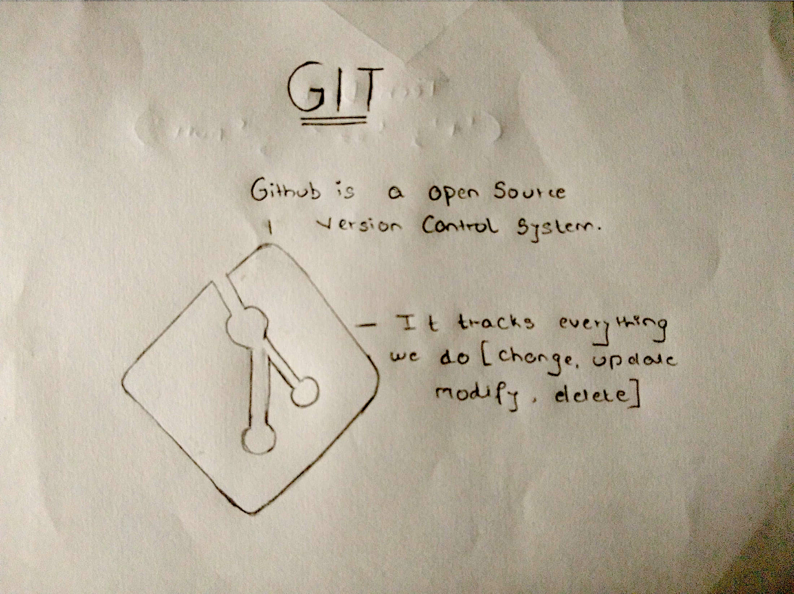

# GIT

---

## Git Commands

---

| Commands                                       | Description                                                                            |
| ---------------------------------------------- | -------------------------------------------------------------------------------------- |
| git init                                       | Creates an empty git repository                                                        |
| git add "filename"                             | Adding the files to the git repository this adds the single file                       |
| git add .                                      | Adding the files to the git repository this adds all the file present                  |
| git status                                     | This tells whether the file has been added or not                                      |
| git commit -m"message"                         | This saves the changes in the repository                                               |
| git commit -a -m                               | Shortcut method to add and commit                                                      |
| git push origin "branchname"                   | This is use to push our file to remote repository                                      |
| git pull origin "branchname"                   | We use this if our local code is behind the remote code                                |
| git branch "name"                              | It is use to create a new branch                                                       |
| git checkout "branchname"                      | It is used to change the branch (eg: from master branch to develop branch)             |
| git checkout --"filename"                      | It is used for recovering the files or reverting the last changes which were made      |
| git fetch origin "branchname"                  | It is used to get something from the remote server                                     |
| git branch "branchname" -D                     | This used to delete a branch                                                           |
| git remote origin "repo-url"                   | It is used to set the remote repository into the local                                 |
| git merge                                      | This is used when we want to merge the two branches                                    |
| git clone "url" (remote-repo-url)              | Clones the already existing repository                                                 |
| git log                                        | Shows us the committed files / History                                                 |
| git diff                                       | Shows us all the changes made to the file before committing                            |
| git shows "commit-id"                          | Shows the modification made to the file when it is committed                           |
| git config --global user.email "email-address" | Setting of configuration files (Basic identity of git account)                         |
| git config --global user.name "name"           | Setting of configuration files (Basic identity of git account)                         |
| git stash                                      | Temporarily stores the changes no need to commit                                       |
| git stash pop                                  | This command is use to bring the files which were not committed when we used git stash |
