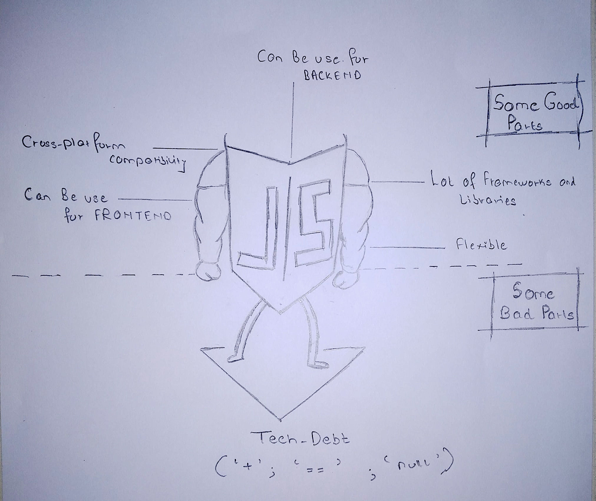

# JAVASCRIPT

---

## 1. About JavaScript

---



- JavaScript was started in 1995.
- By NETSCAPE NAVIGATORS.
- JavaScript is a Scripting Language.
- It's earlier name was "Mocha".

## 2. Tech Debts

---

- There are some Tech Debts in JavaScript.

  1. '+' (Adddition operator)
  2. "null" (typeof is shown as object)
  3. "===" (identity check)

## Addition Operator-

- "+" it concats the two value even if one value is string and the other one is a number

```javascript
// Example 1:
var a = 10;
var b = "hello";

console.log(a + b);

result:
10hello

// Example 2:
var a = 10;
var b = "20";

console.log(a + b);

result:
1020 // Due to tech debt
```

- To overcome this situation we can add another "+"operator in front.

  Example:

```javascript
var a = 10;
var b = "20";

console.log(a + +b);

result: 30;
```
