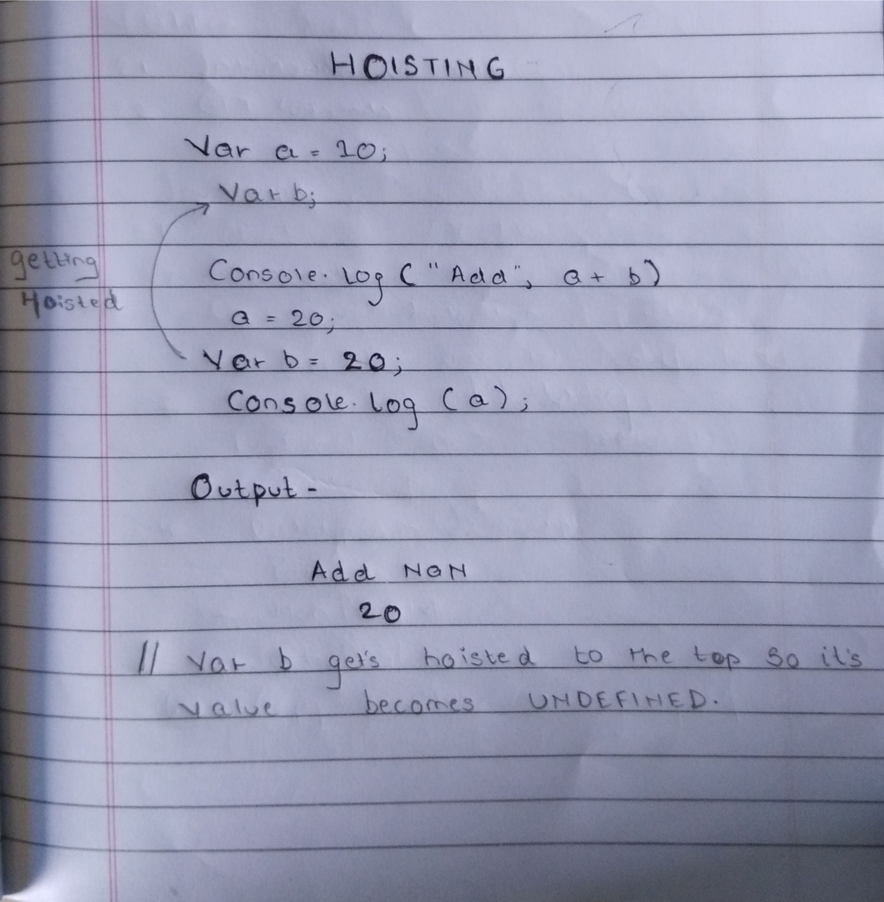

# DataTypes

---

- There are two types of data types in javascript -:

  - **Primitive Datatype**

    - String
    - Number
    - Boolean
    - Symbol

  - **Non Primitive Datatype**

    - Object
    - Arrays

### 1) Primitive Datatypes

1. String

- Strings are present in text and are wrapped in "DOUBLE QUOTES"

```javascript
var a = "My name is Manish";
console.log(a);

output -
My name is Manish
```

2. Numbers

```javascript
var a = 10;
console.log(a);

output - 10;
```

3. Boolean

- Boolean either returns true or false value.

```javascript
10 < 9;
output - False;

100 > 99;
output - True;
```

4. Symbols

- Symbols is newly added feature in
  ES6

### 2) Non Primitive Datatypes

- Non primitives always have a truthy values.

1. Objects

- Objects are denoted by using "{}" curly braces

- Objects are always in the form of pair which looks like this key:values

```javascript
var user {
  id: 10,
  name: "manish",
  age: 21,
};

/* TO ADD NEW VALUE AND KEY IN THE OBJECT*/
user.movie = "inception"
```

2. Arrays

- Array is nothing but a specialized object.

- Array is denoted by using "[]" square brackets.

```javascript
var array = ["goku", "vegeta", "naruto", "kakashi"];

console.log(array);
console.log(array[1]);

output: Array[4];
vegeta;
```

## 2. JavaScript Variables

---

- In JavaScript variable is like a container it holds the data.

- There are mainly 3 type of variables present in javascript which are -
  - var
  - let
  - const

#### Difference between them

| var                     | let                                 | const                               |
| ----------------------- | ----------------------------------- | ----------------------------------- |
| It can be re-declare    | As per ES6 it cannot be re-declared | As per ES6 it cannot be re-declared |
| Can be re-initialize    | Can be re-initialize                | Cannot be re-initialize             |
| It has functional scope | It has lexical scope                | It has lexical scope                |
| Var gets hoisted        | Let doesn't get hoisted             | Const doesn't get hoisted           |

## 3. JavaScript Logical Operators

---

- JavaScript has 3 operators:

  - AND ( && )
  - OR ( || )

### 3.1) AND Operator

| Case   | Output |
| ------ | ------ |
| T && F | False  |
| F && T | False  |
| F && F | False  |
| T && T | False  |

Example:

```javascript
if (34 && 1 && 55) {
  conosle.log("hello");
}

output: hello; // Because all the values are truthy values
```

### 3.2) OR Operator

| Case   | Output |
| ------ | ------ |
| T OR F | True   |
| F OR T | True   |
| F OR F | False  |
| T OR T | True   |

Example:

```javascript
if (0 || "class" || 100 || null) {
  console.log("Hello");
}
output: Hello;
```

## 4. Scopes in JavaScript

---

### 4.1) Functional Scope

- Function scope means its Boundary is limited within that function only.
- Var has a Functional Scope.

Example 1:

```javascript
function sports() {
  var football = "neymar";
  console.log("1.", football);
}
sports();
console.log("2.",football);

output:
1. neymar
2. Refrence Error // because football is defined in the function sports. so it is limited with that function only.
```

Example 2:

```javascript
var a = 10;
var b = 5;
console.log("1.", a + b);

a = 20; // global scope

function hello() {
  console.log("3.", a); // here value will be undefined because var is getting hoisted.
  var a;
}

function hello2() {
  console.log("2.", a); // here no variable is declared so it will fetch the global variable
  a = 3; // new global value will be  updated to 3 beacause no var is decalred over here
}

hello2();
hello();
console.log("4.", a);

output:
1. 15
2. 20
3. undefined
4. 3
```

### 4.2) Lexical Scope ot Block Scope

- In Lexical scope you can access the variables of the parent scope but parent scope cannot access the variables of child's scope.

- Lexical scope are always present in curly brackets "{}".

Example 1:

```javascript
let a = 4;
if (a) {
  // block or lexical scope
  let b = 10;
  let a = 20;
  console.log(a + b);
}

output: 30;
```

Example 2:

```javascript
let a = 5;

if (a) {
  // block or lexical scope
  let b = 5;
  let a = 6;
  console.log(a + b);
}
function hello() {
  // block or lexical scope
  if (a) {
    console.log(a + b);
  } else {
    // block or lexical scope
  }
}

output;

1. 11;
2. ERROR; //here "a" checks it own scope "a" is not present there then "a" checks its parent scope there is also "a" not present then "a" checks "global scope" and in gloabal scope "a" is found but no "b" is present that's why it gives error
```

### 4.3) Hoisting in Javascript

- In JavaScript Hoisting mean the variable "var" moves to the top before the code gets executed.
- Only variable "var" gets Hoisted.
- Only variable declaration can get Hoisted it's initialization will not get Hoisted.



## 5. Pass By Value And Pass By Refrence in JavaScript

---

### 5.1) Pass By value

- All the Primitive Datatypes are **Pass By Value**.
- It copies the value.
- Real life Example would be : Xerox copies

Example:

```javascript
var a = 10;
var b = a;
console.log(b);

output: 10;
```

### 5.2) Pass by Reference

- All the Non-Primitive datatypes are passed by refrence.
- Real life Example would be: Multiple cards of same bank account.
- If we change something in one Object the other Oject will also be change.

```javascript
var stack = {
  node: 1,
  php: 1,
  go: 1,
  ps: [5, 6, 7, 8],
};

var boom = stack;

boom.go = 10;
boom.node = 500;

console.log("1." stack);
console.log("2."boom);

output:
1. {node: 500, php: 1, go: 10, ps: Array(4)}
2. {node: 500, php: 1, go: 10, ps: Array(4)}

// Both will get change because they are passed by reference
```
